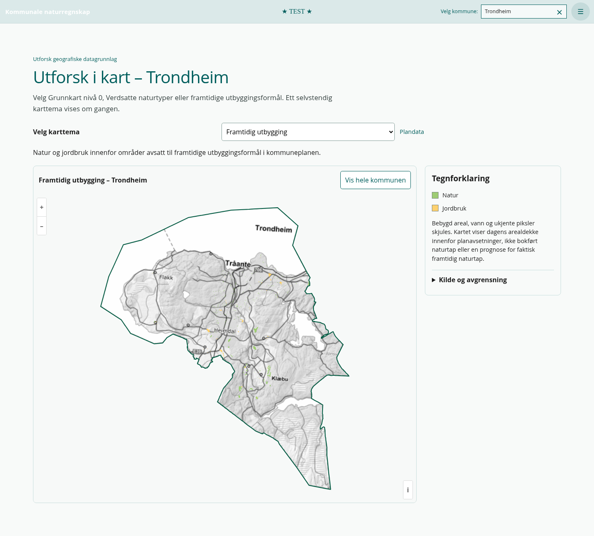
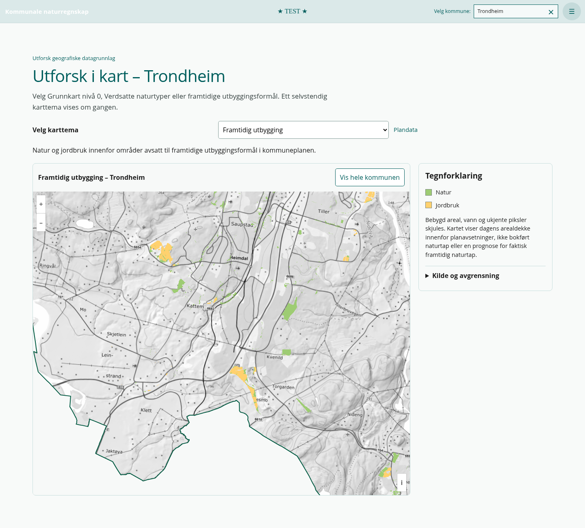
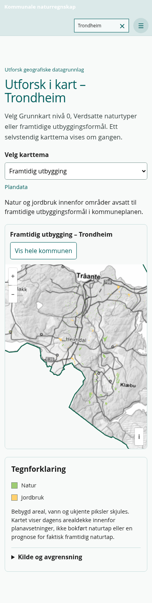
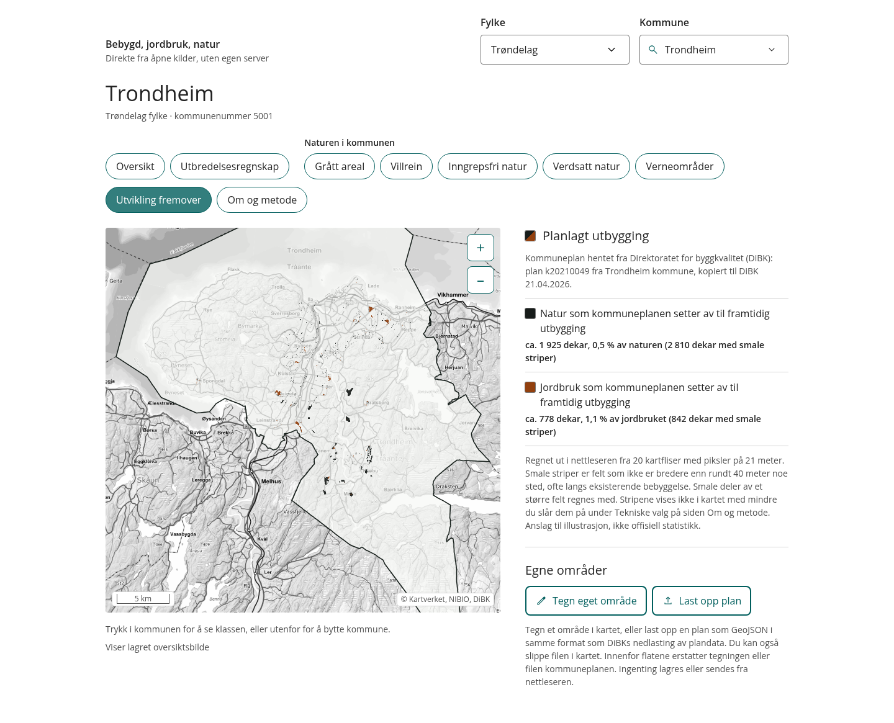
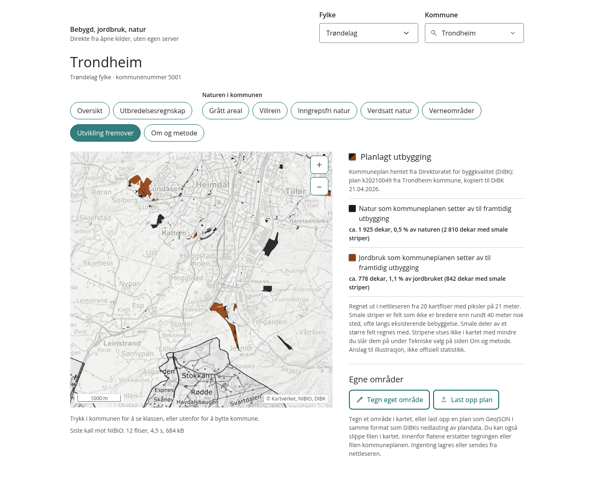

# Korrigert kartvisning av framtidig utbygging

09.10.2026. PR #76, branch `feat/explore-analysis-map`, utgangspunkt
`6d9421e008bf581fc16188730ff91a6448f64e19`. Kontrollert mot dagens main
`a2e270dc7986cb2ce2f9a6c22ffe46e5aa7793db`.

## Resultat og avgrensning

Bare den selvstendige visningen av framtidig utbygging er endret. Den viser
dagens Natur (grønn) og Jordbruk (gul) innenfor framtidige DiBK-formål.
Bebygd, vann og ugyldige piksler skjules. Planfilter, analysemetoder,
prosentnevnere, analysegrid, verdiregler og cachelogikk er uendret.

Det beregnes ingen arealtall i kartvisningen. Dette er ikke bokført naturtap,
en prognose for faktisk framtidig naturtap eller et nytt naturregnskap.
Grunnkart nivå 0, Verdsatte naturtyper, naturtypefilter, velger og navigasjon
beholder sin eksisterende funksjon.

## Faktisk kjørende app og reelle Trondheim-data

Kjørt med `CHROMIUM_PATH=/usr/bin/chromium npm run test:browser:themes`.
Skriptet starter App i Vite og Chromium, velger Trondheim og åpner Utforsk.
HTTPS-kall går gjennom miljøets proxy med TLS-verifikasjon; URL, query, body
og kilderespons beholdes uendret. Ingen fixtures erstatter reelle data.

| Krav | Kontroll | Resultat |
| --- | --- | --- |
| A Bebygd skjules | Råflis med 57 254 Bebygd-piksler innenfor planen; alle gjennomsiktige i faktisk visningsflis | Bestått |
| B Natur vises | 4 103 Natur-piksler i kontrollflisen; grønt i oversikt og detalj | Bestått |
| C Jordbruk vises | 4 784 Jordbruk-piksler i kontrollflisen; gult i oversikt og detalj | Bestått |
| D Geografisk plassering | Samme EPSG:25833-bbox/rutenett for plan og Grunnkart; visuell stedskontroll mot referansen og kommunegrensen | Bestått |
| E Oversikt og nær zoom | Små felt beholdes som svakere grove piksler; detaljfliser vises etter hjul/zoom/pan | Bestått |
| F Temabytte | Rundtur mellom alle tre temaer; kun plantema aktivt i C, irrelevant lokalitetsvalg ryddes | Bestått |
| G Ingen automatisk zoom | Samme senter/oppløsning før/etter temabytte, filter og valg; manuell navigasjon/reset fungerer | Bestått |
| H Mobil 390 px | Alle tre temaer og rundtur; bevart utsnitt, ingen horisontal scrolling | Bestått |

Ekstra pikselkontroll (`H-real-raster-exclusion` i skriptet) laster ekte
DiBK/Grunnkart for `[11, 1021, 743]`, extent
`[264868, 7031232, 267576, 7033940]`. Alle 262 144 piksler sammenlignes mot
nettleserens faktiske OpenLayers-visningsflis. I tillegg til klassene over
skjules 24 vannpiksler i planen, 126 ugyldige/ukjente piksler og 195 853 piksler
utenfor planen. **0 avvik**. Ugyldig/ukjent arealdekke er transparent i rå-SLD-
kontrakten; XML/HTTP-feil blir kartfeil, ikke tomt treff.

I sammensatt kommuneoversikt gjenfinnes 755 grønne og 242 gule kartpiksler
med fargetoleranse, 0 Bebygd-fargede piksler og 0 fra det tidligere blå planlaget.
Dette er bildekontroll, ikke arealtall. Verdsatte naturtyper beholder
1 529 lokaliteter / 90 typer og fungerende filter/kartklikk.
Ingen JavaScript-feil ble registrert i App-kontrollen.

[Maskinlesbar kontroll](2026-10-09-future-development/checks.json).

## Skjermbilder fra kjørende applikasjon

Kommuneoversikt:

Innzoomet ved Heimdal/Kattem/Torgarden:

Mobil, 390 px:

## Intern referansesammenligning

Referanseappen er også kjørt lokalt med ekte kilder, fra commit
`ae6f9f25ac63b746b5a6f44b92dbbb904e73e903`. `src/motor/plan.js` og
`fliser.js` bruker samme filter, rå klasser og EPSG:25833-grid som V3.
Referansen har koksgrå Natur og brun Jordbruk; V3 bruker eksisterende
grønn/gul nivå-0-palett fordi laget nå vises selvstendig.

Visuelt samsvarer Natur-feltene ved Kattem/Tiller og Jordbruk-feltene ved
Solberg/Torgarden/Lersmo. Bebygde flater langs Heimdal og industriområdet
på Heggstadmoen får ingen planfarge. Kommunegrensen ligger riktig.

Referansens standardvisning fjerner komponenter uten kjerne på grovt grid.
Sammenligning er derfor gjort både med standardinnstilling og med dens
stripevisning aktivert. V3s selvstendige kart beholder små/smale treff og
beregner ikke referansens arealtall. Ulikt bakgrunnskart, kartstørrelse og
palett gjør dette til visuell/metodisk sammenligning, ikke identiske screenshots.

Referanse, kommuneoversikt med stripevisning:

Referanse, samme senter/oppløsning som V3s detaljkontroll:

[Standard stripeinnstilling](2026-10-09-future-development/reference-overview.png) og
[referansens kjøringsstatus](2026-10-09-future-development/reference-checks.json).
Referansens arealtall er ikke nye V3-resultater.

## Endrede filer

- `apps/web/src/map/futureDevelopmentDisplay.ts`: visningsfliser og grov aggregering.
- `apps/web/src/map/exploreThemeMap.ts`: plantemaets kilde og tilhørende lasting/opprydding.
- `apps/web/src/features/explore-map/mapThemes.ts`: beskrivelse, forbehold og to legendeposter.
- `apps/web/tests/futureDevelopmentDisplay.test.ts` og `tests/browser/check-explore-themes-live.mjs`: klasse-/gridkontroll, reelle fliser og skjermbilder.
- `AGENTS.md`, `README.md`, `docs/README.md`, `docs/utviklingsplan.md`, levende produkt-/arkitekturdokumenter og ny ADR: korrigert kontrakt for planpresentasjonen.
- Denne kontrollrapporten, kontroll-JSON og seks skjermbilder under `docs/validation/2026-10-09-future-development/`.

## Tester og begrensninger

- `npm test`: 117 tester i 21 filer bestått, inkludert nye eksklusjons-/gridtester og eksisterende analyse-/cache-regresjoner.
- `npm run lint`: bestått, 0 feil; eksisterende Fast Refresh-advarsel i EcosystemPage.
- `npm run build`: bestått; eksisterende advarsel om bundle over 500 kB.
- `CHROMIUM_PATH=/usr/bin/chromium npm run test:browser`: bestått; beholdt analyse-renderkontroll.
- `CHROMIUM_PATH=/usr/bin/chromium npm run test:browser:themes`: alle kontroller bestått med reelle data.
- `git diff --check`: bestått.

Grov visning krever klargjort kommuneoversikt, foreløpig Trondheim. Et felt
under halvparten av en 21,16 m piksel kan mangle i oversikten, men fremkomme
på detaljnivå. Ved grov blandingspiksel vises dominerende klasse; alfa følger
treffandelen. Nærmeste kildepiksel brukes ved oversiktssampling for å unngå
fiktive RGB-blandinger. Ingen stripefjerning gjøres i denne presentasjonen;
analysenes eksisterende stripebehandling er uendret.

Ny [beslutning](../decisions/2026-10-09-v3-future-development-display.md)
og levende produkt-/arkitekturdokumenter er oppdatert. Publisering gjøres
via eksisterende Pages-workflow fra PR-branchen, uten merge til main.
